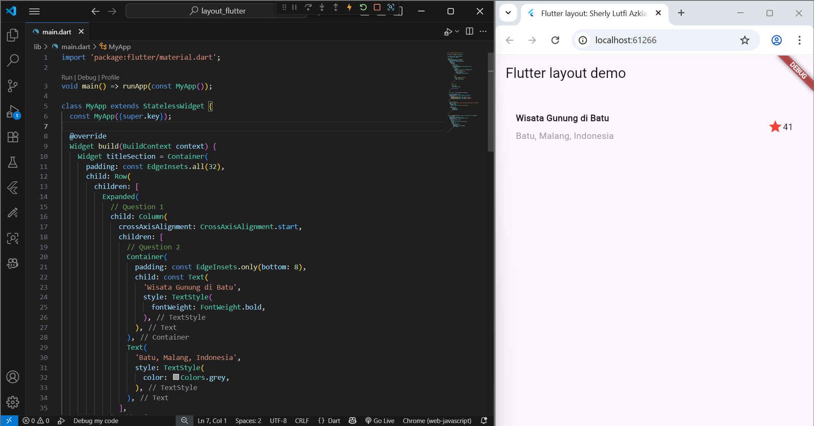
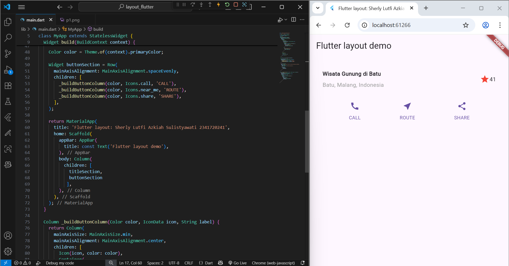
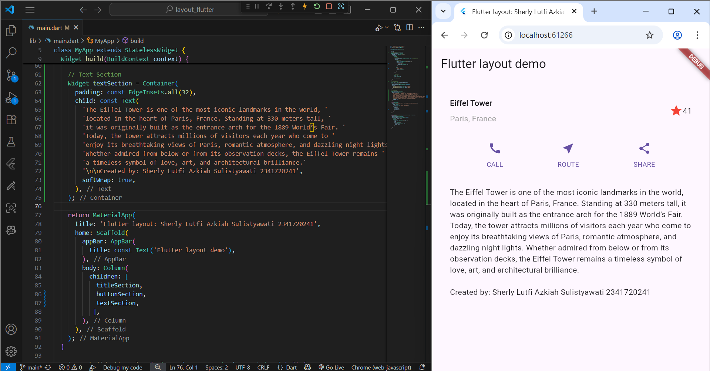
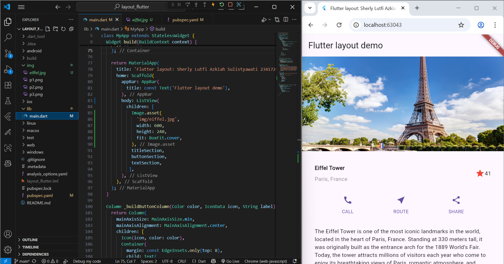

# layout_flutter

A new Flutter project.

## Getting Started

This project is a starting point for a Flutter application.

A few resources to get you started if this is your first Flutter project:

- [Lab: Write your first Flutter app](https://docs.flutter.dev/get-started/codelab)
- [Cookbook: Useful Flutter samples](https://docs.flutter.dev/cookbook)

For help getting started with Flutter development, view the
[online documentation](https://docs.flutter.dev/), which offers tutorials,
samples, guidance on mobile development, and a full API reference.

**Practical Assignment 1**

**Practical 1: Building a Layout in Flutter**

In this practicum, a title display is created that shows the name of the place and its location in a Row. The goal is to learn how to arrange text and icons so that they appear neatly in a single line.

**Practical 2: Implementation of button row**

Here, three buttons are added in a row: CALL, ROUTE, and SHARE. This exercise aims to teach how to use Row and Column in Flutter to arrange several elements horizontally and vertically.

**Practical 3: Implementation of text section**

In this practicum, a descriptive paragraph is created below the row of buttons. The goal is to learn how to use Containers and apply padding so that the text has spacing and is comfortable to read.

**Practical 4: Implementation of image section**

In this practicum, an image is added at the top of all elements, then the entire display is wrapped in a ListView so that the page can be scrolled. The goal is to learn how to use Image.asset, set image size with BoxFit, and create a flexible and responsive layout.
